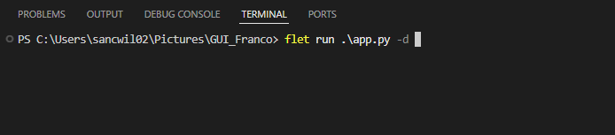

# Para usar el programa sin tener que hacerlo .exe

## Paquetes necesarios para poder usarlos son 
1. flet
2. flet[all}
3. matplotlib
4. PIL
5. Numpy

## Para instalar todos los paquetes desde CLI (Command line interpetrer) o CMD:
Usa el siguiente comando ~~Tener python >3.12
`pip -r install requeriments.txt`

## seguido abrir la carpeta del codigo en cualquier edito, ya sea Atom, VC, Vim, SublimeText, y ejecutar app.py directamente o desde la barra de comando.
 
para cerrar el software en la barra de comandos del interpetre presionar `ctrl + c`
